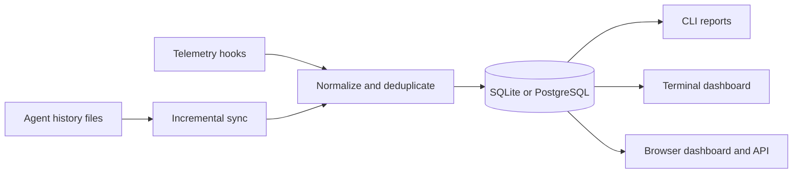

# Agentusage

[](https://github.com/binzhango/agentusage/actions/workflows/ci.yml)
[](https://github.com/binzhango/agentusage/releases/latest)
[](LICENSE)

**A private, local-first usage dashboard for AI coding agents.**

Agentusage turns the history already written by Codex, Claude Code, OpenCode,
Pi, and GitHub Copilot into a browser dashboard, terminal UI, JSON API, and CLI
reports. Use it to compare model activity, understand token and cache usage,
and track estimated cost without sending usage data to a hosted service.


> **Status:** Early access. Provider formats evolve frequently, so sanitized
> fixtures, bug reports, and pull requests are especially valuable.

## Highlights

- Browser dashboard with provider cards and dedicated full-page views
- Today, 7-day, 30-day, and all-time usage windows
- Per-model trend lines with detailed hover data
- Token, cache, request, session, cost, and code-change metrics
- Downloadable SVG snapshots of provider cards
- Hideable provider cards with persistent dashboard preferences
- Interactive terminal dashboard and period-based CLI reports
- Local JSON API for scripts and custom integrations
- SQLite by default, with optional PostgreSQL
- Incremental, idempotent ingestion with raw event preservation
- Light and dark themes

## Supported providers

| Provider | Local source | Imported data |
| --- | --- | --- |
| `codex` | Codex rollout JSONL | Tokens, models, cache, cost, sessions, code changes |
| `claude_code` | Claude Code session JSONL | Tokens, models, sessions |
| `opencode` | OpenCode session JSONL | Tokens, models, sessions, cost |
| `copilot` | Copilot CLI databases and VS Code logs | CLI/IDE attribution, models, tokens, AI credits |
| `pi` | Pi append-only session JSONL | Providers, models, prompts, tokens, cost, projects, tools |

## Quick start

Install the `agentusage` command and its shorter `au` alias:

```bash
cargo install --git https://github.com/binzhango/agentusage --locked --bins
au --version
```

Synchronize the providers you use, then open the dashboard:

```bash
au sync codex
au sync claude_code
au sync copilot
au sync pi
au server --open
```

If the browser does not open automatically, visit
[http://127.0.0.1:8787](http://127.0.0.1:8787).

Only synchronized providers are available. If a provider card reports that its
storage is uninitialized, run `au sync <provider>` or hide the card when you do
not use that provider.

## Ways to explore usage

### Browser dashboard

```bash
au server --open
```

The dashboard includes summary metrics, daily trends, per-model breakdowns,
full-page provider views, persistent card visibility, themes, and SVG export.
It is embedded in the Rust binary; no Node.js runtime or separate frontend
server is required.

### Terminal dashboard

```bash
au dashboard
```

Use `w` to change the time window, `r` to refresh, and `q` to quit.


### CLI reports

```bash
au daily --provider codex
au weekly --provider codex
au monthly --provider copilot --month 2026-07
au range --provider pi --from 2026-07-01 --to 2026-07-31
```


### JSON API

```bash
au server
curl 'http://127.0.0.1:8787/api/summary?provider=codex&window=30d'
```

The local server exposes provider availability, aggregate summaries, and daily
trend data. See the [API reference](docs/API.md) for routes and response fields.

## Installation

Download a prebuilt archive from the
[latest release](https://github.com/binzhango/agentusage/releases/latest), or
install from a local checkout:

```bash
cargo install --path . --locked --bins
```

Release archives are available for macOS Apple Silicon, Linux ARM64, Linux
x86_64, and Windows x86_64. Each archive contains both `agentusage` and `au`,
plus checksums in `SHA256SUMS`.

## How it works

Agentusage reads provider history during incremental synchronization, normalizes
and deduplicates usage events, and stores them in provider-specific databases.
Reports, dashboards, and API requests query the normalized database rather than
rescanning source files.



SQLite and all browser endpoints are local by default. PostgreSQL is used only
when explicitly configured.

## Documentation

| Guide | Contents |
| --- | --- |
| [Usage guide](docs/USAGE.md) | Synchronization, dashboard, reports, Pi, and command examples |
| [API reference](docs/API.md) | HTTP routes, parameters, response fields, and error behavior |
| [Configuration](docs/CONFIGURATION.md) | Storage, automatic sync, PostgreSQL, telemetry, and privacy |
| [Development](docs/DEVELOPMENT.md) | Local setup, tests, and contributor checks |
| [Releasing](docs/RELEASING.md) | Versioning, builds, crates.io, and GitHub releases |
| [Changelog](CHANGELOG.md) | Release history |

## Privacy and security

Agentusage does not require a hosted account and does not send usage data to a
project-controlled service. Provider history, normalized databases, raw events,
and PostgreSQL credentials may contain sensitive information and should be
protected accordingly.

The HTTP server binds to `127.0.0.1` by default and has no built-in
authentication. Do not expose it to an untrusted network without a protective
reverse proxy.

## Contributing

Bug reports and pull requests are welcome. When changing provider ingestion:

1. Include a sanitized fixture or regression test when possible.
2. Preserve idempotent ingestion and backward-compatible storage behavior.
3. Run the checks in [docs/DEVELOPMENT.md](docs/DEVELOPMENT.md).
4. Never commit credentials, private transcripts, or local databases.

## License

Agentusage is available under the [MIT License](LICENSE).
