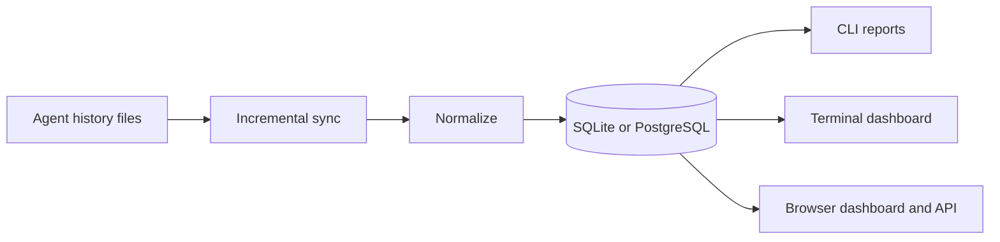

# Agentusage

[](https://github.com/binzhango/agentusage/actions/workflows/ci.yml)
[](https://github.com/binzhango/agentusage/releases/latest)
[](LICENSE)

**A private, local-first usage dashboard for AI coding agents.**

Agentusage turns the history already written by Codex, Claude Code, OpenCode,
Pi, and GitHub Copilot into a browser dashboard, terminal UI, JSON API, and CLI
reports. Use it to compare model activity, understand token and cache usage,
and track estimated cost without sending usage data to a hosted service.


> Provider formats evolve frequently. Agentusage rejects malformed usage
> records without source timestamps and keeps raw source events for auditing.

## Highlights

- Browser dashboard with provider cards and dedicated full-page views
- Today, 7-day, 30-day, and all-time usage windows
- Per-model trend lines with detailed hover data
- Token, cache, request, session, cost, and code-change metrics
- Downloadable SVG snapshots of provider cards
- Hideable provider cards with persistent dashboard preferences
- Interactive terminal dashboard with trends and request-level drill-down
- Local JSON API with aggregate, trend, and paginated request endpoints
- Private prompt-history browsing in the TUI and browser, with local search
- SQLite by default, with optional PostgreSQL
- Incremental, idempotent ingestion with raw event preservation
- Light and dark themes

## Supported providers

| Provider | Local source | Imported data |
| --- | --- | --- |
| `codex` | Codex rollout JSONL | Prompts, tokens, models, cache, cost, sessions, code changes |
| `claude_code` | Claude Code session JSONL | Prompts, tokens, models, sessions |
| `opencode` | OpenCode session JSONL | Prompts, tokens, models, sessions, cost |
| `copilot` | Copilot CLI databases and VS Code logs | CLI/IDE attribution, models, tokens, AI credits |
| `pi` | Pi append-only session JSONL | Providers, models, prompts, tokens, cost, projects, tools |

## Install

Download a prebuilt archive from the
[latest release](https://github.com/binzhango/agentusage/releases/latest),
verify it against `SHA256SUMS`, and place the executables on your `PATH`.
Archives are available for macOS Apple Silicon, Linux ARM64, Linux x86_64, and
Windows x86_64.

Alternatively, install both executable names with Rust 1.85 or newer:

```bash
cargo install agentusage --locked
au --version
```

`agentusage` and `au` are equivalent; this guide uses the shorter `au` alias.
For a local checkout, run `cargo install --path . --locked --bins`.

Every launch performs a short release check. If a newer version is available,
Agentusage prints the release link and upgrade command; network failures remain
silent and do not prevent the requested command from starting.

## Quick start

### 1. Synchronize one provider

Start with a coding agent you already use:

```bash
au sync codex
```

Replace `codex` with `claude_code`, `opencode`, `copilot`, or `pi` as needed.
On first use, Agentusage asks where to store normalized usage. SQLite is the
recommended default: enter `s` at the prompt. It creates a provider-specific
database such as:

```text
~/.local/state/agentusage/codex.db
```

For PostgreSQL, configure `AGENTUSAGE_POSTGRES_URL` before the first sync and
choose `p`; see [Configuration](docs/CONFIGURATION.md#postgresql).

Synchronization reads the provider's existing local history without modifying
it. It is incremental and idempotent, so rerunning the same command imports
only new or changed records.

Synchronize additional providers only when you use them:

```bash
au sync claude_code
au sync opencode
au sync copilot
au sync pi
```

### 2. Choose how to view the data

```bash
# Interactive terminal dashboard
au dashboard

# Browser dashboard and local JSON API
au server --open

# One-off command-line report
au daily --provider codex
```

If the browser does not open automatically, visit
[http://127.0.0.1:8787](http://127.0.0.1:8787). Only synchronized providers
have data. An unavailable provider can be initialized with
`au sync <provider>` or hidden from the browser dashboard.

### Command map

| Command | Purpose |
| --- | --- |
| `au sync <provider>` | Import new local history into normalized storage |
| `au dashboard` | Open the interactive terminal dashboard |
| `au server --open` | Start the loopback-only browser dashboard and API |
| `au daily`, `weekly`, `monthly`, `yearly` | Synchronize and print a period report |
| `au range --from <DATE> --to <DATE>` | Synchronize and print an inclusive custom-range report |
| `au <command> --help` | Show all options for a command |

## Ways to explore usage

### Browser dashboard

```bash
au server --open
```

Select a time window, then use each provider card to inspect summary metrics,
daily trends, and per-model breakdowns. Select `Show prompts` to retrieve prompt
previews, or open the provider's full-page view for prompt search and paginated
history. Card visibility, themes, and SVG export are available from the page.

Prompt bodies are not fetched until `Show prompts` is selected. The dashboard
is embedded in the Rust binary; no Node.js runtime or separate frontend server
is required.

Prompt history contains textual user messages only. Assistant responses, tool
results, and provider metadata messages are excluded. GitHub Copilot's current
local sources do not expose prompt bodies, so its prompt history is empty.

### Terminal dashboard

```bash
au dashboard
```

| Action | Keys |
| --- | --- |
| Select a provider or row | Arrow keys or `j`/`k`; use `h`/`l` between providers |
| Open recent requests | `Enter` on a provider |
| Open prompt history directly | `p` on a provider |
| Switch requests/prompts | `p` in a detail view |
| Expand the selected request or prompt | `Enter` |
| Scroll detail content | `Ctrl+U`/`Ctrl+D`, `Space`/`b`, or mouse wheel |
| Make a larger scroll jump | `Ctrl+B`/`Ctrl+F` |
| Jump to the beginning/end | `Home`/`End` |
| Close the current level or return | `Esc` or `Backspace` |
| Select Today / Week / 30 Days / All | `1` / `2` / `3` / `4` (or `w` to cycle) |
| Synchronize and refresh | `r` |
| Toggle mouse capture | `m` |
| Quit | `q` or `Ctrl+C` |

To copy rendered text on macOS, press `m` to release mouse capture, select the
text normally, and press `Cmd+C`. Press `m` again to restore mouse-wheel
scrolling.

The active date range stays visible in the header, and the bordered shortcut
panel at the bottom changes with the current view.


### CLI reports

```bash
au daily --provider codex
au weekly --provider codex
au monthly --provider copilot --month 2026-07
au range --provider pi --from 2026-07-01 --to 2026-07-31
```


### JSON API

```bash
au server
curl 'http://127.0.0.1:8787/api/summary?provider=codex&window=30d'
```

The local server exposes provider availability, aggregate summaries, daily
trends, paginated request events, and searchable prompt history. See the
[API reference](docs/API.md) for routes and response fields.


## How it works

Agentusage reads provider history during incremental synchronization, normalizes
and deduplicates usage events, and stores them in provider-specific databases.
Reports, dashboards, and API requests query the normalized database rather than
rescanning source files.


```mermaid
flowchart LR
    Sources[Agent history files] --> Sync[Incremental sync]
    Sync --> Normalize
    Normalize --> Storage[(SQLite or PostgreSQL)]
    Storage --> CLI[CLI reports]
    Storage --> TUI[Terminal dashboard]
    Storage --> Web[Browser dashboard and API]
```

SQLite and all browser endpoints are local by default. PostgreSQL is used only
when explicitly configured.

Token totals follow provider-specific semantics: OpenAI cache and reasoning
fields are treated as breakdowns of input/output totals, Anthropic cache input
is additive while reasoning is an output breakdown, and providers with
independent counters use additive totals. A provider-reported total is
authoritative when present.

## Documentation

| Guide | Contents |
| --- | --- |
| [Usage guide](docs/USAGE.md) | Synchronization, dashboard, reports, Pi, and command examples |
| [API reference](docs/API.md) | HTTP routes, parameters, response fields, and error behavior |
| [Configuration](docs/CONFIGURATION.md) | Storage, automatic sync, PostgreSQL, and privacy |
| [Development](docs/DEVELOPMENT.md) | Local setup, tests, and contributor checks |
| [Releasing](docs/RELEASING.md) | Versioning, builds, crates.io, and GitHub releases |
| [Changelog](CHANGELOG.md) | Release history |

## Privacy and security

Agentusage does not require a hosted account and does not send usage data to a
project-controlled service. Provider history, prompt text, normalized
databases, raw events, and PostgreSQL credentials may contain sensitive
information and should be protected accordingly.

The HTTP server accepts loopback hosts only (`127.0.0.1`, `localhost`, or
`::1`) and has no built-in authentication.

## Contributing

Bug reports and pull requests are welcome. When changing provider ingestion:

1. Include a sanitized fixture or regression test when possible.
2. Preserve deterministic, idempotent normalization and documented token semantics.
3. Run the checks in [docs/DEVELOPMENT.md](docs/DEVELOPMENT.md).
4. Never commit credentials, private transcripts, or local databases.

## License

Agentusage is available under the [MIT License](LICENSE).
