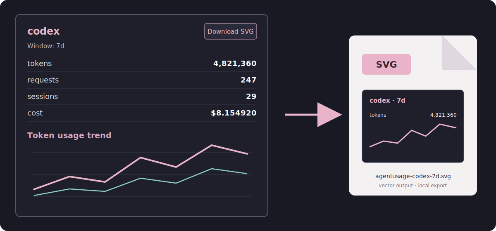

# Usage guide

This guide covers provider synchronization and the browser, terminal, and
command-line interfaces. For installation and a quick introduction, start with
the [README](../README.md).

## Synchronize provider data

Agentusage imports the local history already maintained by each supported
coding agent:

```bash
au sync codex
au sync claude_code
au sync opencode
au sync copilot
au sync pi
```

Each provider uses a separate normalized database. Synchronization is
incremental and idempotent, so the commands are safe to run repeatedly.

A provider that has not been synchronized may appear as unavailable:

```text
no initialized SQLite or PostgreSQL usage storage found;
run `agentusage sync opencode` after selecting a database backend
```

Run the suggested command when you use that provider. Otherwise, hide its card
from the browser dashboard.

To import from a non-default source directory:

```bash
au sync codex --sessions-dir /path/to/codex/sessions
```

Compatibility forms such as `agentusage sync --provider codex` and
`agentusage ingest --provider codex` are also supported.

## Browser dashboard

Start the local server:

```bash
au server --open
```

The default URL is [http://127.0.0.1:8787](http://127.0.0.1:8787). Available
options are:

| Option | Default | Description |
| --- | --- | --- |
| `--host <HOST>` | `127.0.0.1` | Address on which the server listens |
| `--port <PORT>` | `8787` | TCP port |
| `--open` | disabled | Open the dashboard in the system browser |
| `--verbose` | disabled | Print request, backend, query, ingestion, and timing logs |

Example:

```bash
au server --host 127.0.0.1 --port 9000 --open
```

The page is embedded directly in the Rust binary. It does not require a
separate frontend server, Node.js runtime, hosted account, or external chart
service.

### Dashboard features

Every available provider includes:

- tokens, requests, sessions, and estimated cost;
- daily total and per-model trend lines;
- hover details with model, date, and token count;
- input, output, cache-read, cache-write, and total-token tables;
- a dedicated full-page provider view;
- downloadable SVG snapshots;
- light and dark themes.

The main page supports hiding provider cards. Hidden cards are remembered in
the browser and can be restored individually or all at once from the header
dropdown.

Time-range controls include `Today`, `7 Days`, `30 Days`, and `All Time`.
All-time summaries use complete history, while all-time trend charts show the
latest 90 days to remain readable and inexpensive.

### Export a provider card

Select a time range and choose `Download SVG` on a provider card. The export
includes the summary metrics, chart, legend, provider breakdown when present,
and model table. Files use names such as:

```text
agentusage-codex-7d.svg
```

SVG files can be opened in current browsers, Preview, Figma, and most design
tools. Generation happens entirely in the browser.



## Terminal dashboard

Start the interactive terminal UI:

```bash
au dashboard
```

Keyboard controls:

| Key | Action |
| --- | --- |
| `w` | Cycle through time windows |
| `r` | Refresh |
| `q` | Quit |

The terminal dashboard requires an interactive terminal.

## CLI reports

Period commands accept `--provider` and produce detailed usage reports:

```bash
# Today
au daily --provider codex

# Specific date
au daily --provider codex --date 2026-07-19

# Current or selected period
au weekly --provider codex
au monthly --provider copilot --month 2026-07
au yearly --provider claude_code --year 2026

# Inclusive date range
au range --provider pi --from 2026-07-01 --to 2026-07-19
```

Reports may include:

- requests, prompts, sessions, lines added, and lines removed;
- input, output, reasoning, cache-read, cache-write, and total tokens;
- estimated cost and cache-hit rate;
- model and client breakdowns;
- project or workspace breakdowns;
- tool-call and language breakdowns;
- Copilot AI credits and provider-native AI units.

Available command help:

```text
agentusage --help
agentusage dashboard --help
agentusage server --help
agentusage sync --help
agentusage daily --help
agentusage weekly --help
agentusage monthly --help
agentusage yearly --help
agentusage range --help
agentusage telemetry --help
```

Running `agentusage` without a subcommand prints the top-level help.

## Pi coding agent

[Pi](https://pi.dev/) is a terminal coding agent with a unified multi-provider
model interface. Agentusage reads its append-only JSONL sessions and imports
prompts, assistant requests, input and output tokens, cache activity, reported
cost, models, projects, and tool calls.

Pi is shown as one agent card even when a session switches providers. Model
identities include the provider, for example:

```text
openai-codex:gpt-5.6-luna
```

Synchronize and report Pi usage with:

```bash
au sync pi
au daily --provider pi
```

Pi sessions are discovered recursively under `~/.pi/agent/sessions/` by
default. Use either form for a custom directory:

```bash
PI_CODING_AGENT_SESSION_DIR=/path/to/sessions au sync pi
au sync pi --sessions-dir /path/to/sessions
```

When the Pi ingestion format changes, synchronization may rebuild the derived
database from its source JSONL. The previous database is retained as
`pi.db.legacy` or a numbered variant.

Pi's reported cost remains an estimate. Subscription usage is not treated as a
direct invoice.

## Next steps

- See [API.md](API.md) for local HTTP integrations.
- See [CONFIGURATION.md](CONFIGURATION.md) for storage, automatic sync,
  PostgreSQL, telemetry hooks, and security notes.
