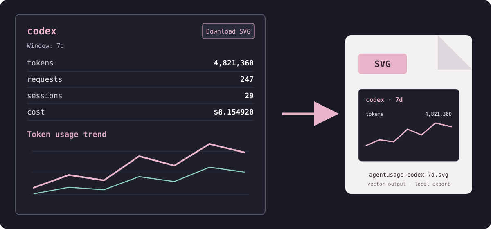

# Usage guide

This guide covers provider synchronization and the browser, terminal, and
command-line interfaces. For installation and a quick introduction, start with
the [README](../README.md).

## Synchronize provider data

Agentusage imports the local history already maintained by each supported
coding agent:

```bash
au sync codex
au sync claude_code
au sync opencode
au sync copilot
au sync pi
```

Each provider uses a separate normalized database. Synchronization is
incremental and idempotent, so the commands are safe to run repeatedly.

A provider that has not been synchronized may appear as unavailable:

```text
no initialized SQLite or PostgreSQL usage storage found;
run `agentusage sync opencode` after selecting a database backend
```

Run the suggested command when you use that provider. Otherwise, hide its card
from the browser dashboard.

After upgrading to a build that adds prompt history, synchronize each provider
once so existing source history is indexed. Synchronization is idempotent and
does not modify the original agent history:

```bash
au sync codex
au sync claude_code
au sync opencode
au sync pi
```

To import from a non-default source directory:

```bash
au sync codex --sessions-dir /path/to/codex/sessions
```

## Browser dashboard

Start the local server:

```bash
au server --open
```

The default URL is [http://127.0.0.1:8787](http://127.0.0.1:8787). Available
options are:

| Option | Default | Description |
| --- | --- | --- |
| `--host <HOST>` | `127.0.0.1` | Loopback host (`127.0.0.1`, `localhost`, or `::1`) |
| `--port <PORT>` | `8787` | TCP port |
| `--open` | disabled | Open the dashboard in the system browser |
| `--verbose` | disabled | Print request, backend, query, ingestion, and timing logs |

Example:

```bash
au server --host 127.0.0.1 --port 9000 --open
```

The page is embedded directly in the Rust binary. It does not require a
separate frontend server, Node.js runtime, hosted account, or external chart
service.

### Dashboard features

Every available provider includes:

- tokens, requests, sessions, and estimated cost;
- daily total and per-model trend lines;
- hover details with model, date, and token count;
- input, output, cache-read, cache-write, and total-token tables;
- recent prompt previews with expandable full text and pagination;
- prompt search in full-page provider views;
- a dedicated full-page provider view;
- downloadable SVG snapshots;
- light and dark themes.

The main page supports hiding provider cards. Hidden cards are remembered in
the browser and can be restored individually or all at once from the header
dropdown.

Prompt bodies are opt-in: select `Show prompts` on a provider card to retrieve
them from local storage. Full-page provider views also provide prompt search
and paginated loading.

Time-range controls include `Today`, `7 Days`, `30 Days`, and `All Time`.
All-time summaries use complete history, while all-time trend charts show the
latest 90 days to remain readable and inexpensive.

### Export a provider card

Select a time range and choose `Download SVG` on a provider card. The export
includes the summary metrics, chart, legend, provider breakdown when present,
and model table. Files use names such as:

```text
agentusage-codex-7d.svg
```

SVG files can be opened in current browsers, Preview, Figma, and most design
tools. Generation happens entirely in the browser.



## Terminal dashboard

Start the interactive terminal UI:

```bash
au dashboard
```

Keyboard controls:

| Key | Action |
| --- | --- |
| `↑` / `↓`, `j` / `k` | Select a provider, recent request, or prompt |
| `Enter` / `Tab` | Open provider detail or return to the grid |
| `p` in detail | Switch between recent requests and prompts |
| `Enter` in detail | Toggle metadata or full prompt text for the selected row |
| `PageUp` / `PageDown`, `Ctrl+U` / `Ctrl+D`, mouse wheel | Scroll provider detail |
| `m` | Toggle mouse capture; turn it off to select and copy text with the terminal |
| `w` | Cycle through time windows |
| `r` | Refresh |
| `Esc` | Close request detail or return to the grid |
| `q` | Quit from any view |

The detail view includes a daily token sparkline, provider/model breakdowns,
the 25 most recent normalized requests, and the 25 most recent retrievable user
prompts. Timestamps are shown in the machine's local timezone. Prompt bodies
remain local and are available only when the provider persists them. The
terminal dashboard requires an interactive terminal.

PageUp/PageDown remain supported where available. On macOS keyboards, use
`Ctrl+U`/`Ctrl+D` for a page-sized scroll, the mouse wheel for smaller steps,
or `Ctrl+B`/`Ctrl+F` for larger jumps. `Space` and `b` also move down and up.

If your macOS terminal does not let Option/Shift bypass mouse reporting, press
`m` to disable mouse capture, select the rendered text normally, and copy it
with `Cmd+C`. Press `m` again to restore mouse-wheel scrolling.

## Prompt history

Agentusage retrieves prompt text from textual user-message records already
stored in local provider history. It excludes assistant responses, tool
results, and provider metadata messages from prompt results.

| Provider | Prompt source | Availability |
| --- | --- | --- |
| `codex` | User messages in rollout JSONL | Supported |
| `claude_code` | Non-metadata user messages in session JSONL | Supported |
| `opencode` | Text parts associated with user messages | Supported |
| `pi` | User messages in append-only session JSONL | Supported |
| `copilot` | Copilot CLI databases and VS Code logs | Not exposed by the current local sources |

In the browser, choose `Show prompts` on a provider card. Open the full provider
page to search prompt text and load older pages. Prompt text is not requested
by the page before that explicit action and is not included in downloaded SVG
card snapshots.

In the terminal dashboard, open a provider and press `p`. Use `j`/`k` or the
arrow keys to select a prompt, then press `Enter` to expand its full text and
source metadata. The list follows the dashboard's active time window and shows
up to 25 recent prompts.

Prompt records can include a timestamp, model, session, project, provider
source, and source locator. Some providers do not persist every field, so
optional metadata can be empty. Search is a case-insensitive substring match.

Prompt text can contain source code, credentials pasted into an agent, file
paths, or other confidential data. The server is loopback-only and marks API
responses `Cache-Control: no-store`, but any local process or person with access
to the database can read stored prompts. Protect normalized databases and avoid
copying prompt API responses into bug reports or release artifacts.

If prompt history is empty for a supported provider:

1. Confirm the selected time window contains user messages.
2. Run `au sync <provider>` again to index existing source history.
3. Confirm the provider's original history still contains textual user
   messages; deleted or tool-only records cannot be reconstructed.
4. Use `/api/prompts?provider=<provider>&window=all` to distinguish missing data
   from a TUI or browser filter.

## CLI reports

Period commands accept `--provider` and produce detailed usage reports:

```bash
# Today
au daily --provider codex

# Specific date
au daily --provider codex --date 2026-07-19

# Current or selected period
au weekly --provider codex
au monthly --provider copilot --month 2026-07
au yearly --provider claude_code --year 2026

# Inclusive date range
au range --provider pi --from 2026-07-01 --to 2026-07-19
```

Reports may include:

- requests, prompts, sessions, lines added, and lines removed;
- input, output, reasoning, cache-read, cache-write, and total tokens;
- estimated cost and cache-hit rate;
- model and client breakdowns;
- project or workspace breakdowns;
- tool-call and language breakdowns;
- Copilot AI credits and provider-native AI units.

Available command help:

```text
agentusage --help
agentusage dashboard --help
agentusage server --help
agentusage sync --help
agentusage daily --help
agentusage weekly --help
agentusage monthly --help
agentusage yearly --help
agentusage range --help
```

Running `agentusage` without a subcommand prints the top-level help.

## Pi coding agent

[Pi](https://pi.dev/) is a terminal coding agent with a unified multi-provider
model interface. Agentusage reads its append-only JSONL sessions and imports
prompts, assistant requests, input and output tokens, cache activity, reported
cost, models, projects, and tool calls.

Pi is shown as one agent card even when a session switches providers. Model
identities include the provider, for example:

```text
openai-codex:gpt-5.6-luna
```

Synchronize and report Pi usage with:

```bash
au sync pi
au daily --provider pi
```

Pi sessions are discovered recursively under `~/.pi/agent/sessions/` by
default. Use either form for a custom directory:

```bash
PI_CODING_AGENT_SESSION_DIR=/path/to/sessions au sync pi
au sync pi --sessions-dir /path/to/sessions
```

Pi's reported cost remains an estimate. Subscription usage is not treated as a
direct invoice.

## Next steps

- See [API.md](API.md) for local HTTP integrations.
- See [CONFIGURATION.md](CONFIGURATION.md) for storage, automatic sync,
  PostgreSQL, and security notes.
